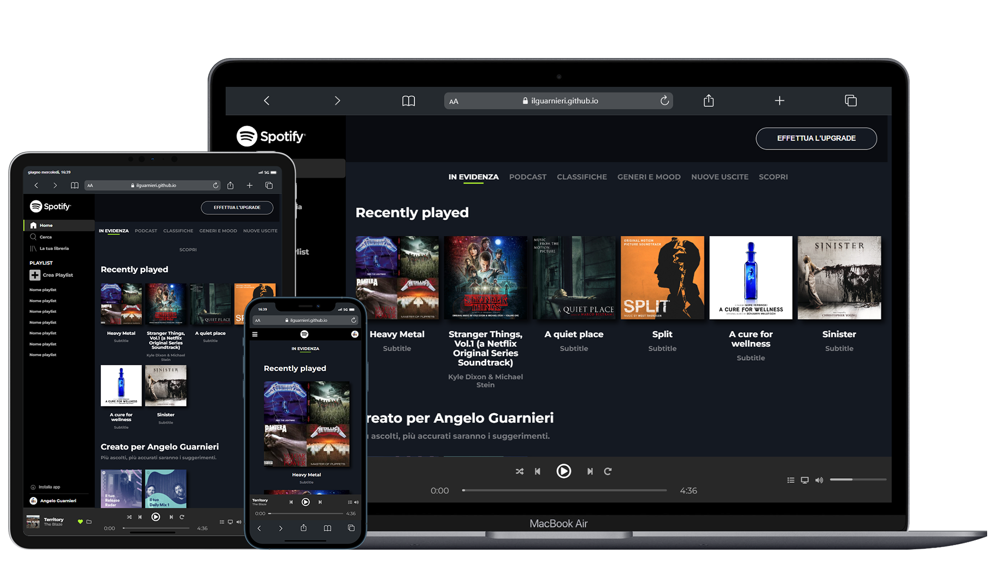

 

<h1 align="center" title="Unicode Formatter">ＳＰＯＴＩＦＹ</h1>

Cʀᴇᴀᴛᴇ ꜱᴩᴏᴛɪꜰʏ ᴡᴇʙ ᴀᴩᴩ - ᴅᴇꜱᴋᴛᴏᴩ, ᴛᴀʙʟᴇᴛ ᴀɴᴅ ᴍᴏʙɪʟᴇ ᴠᴇʀꜱɪᴏɴ

<h3 align="center">
𝙑𝙞𝙚𝙬 𝙨𝙞𝙩𝙚

</h3>
 

## ⛏️ Tecnologies, addons and plugins used
- [HTML](https://html.com);
- [CSS](https://www.w3.org/TR/CSS/);
- [Font Awesome](https://fontawesome.com "Font Awesome's Homepage") for some icons.

## 👨‍💻 Authors
- [@ilguarnieri](https://www.flowcode.com/page/ilguarnieri)
